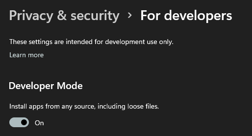

# Powershell script for install WSA with GAPPS

Reference: [ADeltaX/WSAGAScript](https://github.com/ADeltaX/WSAGAScript/)

Only tested on **Win11 x86_64 21H2 and WSL Ubuntu 18.04 LTS**

## Before

* Please enable windows developer mode in settings.

  
* Uninstall any installed WSA.
* Clone repo or Download `InstallWSA_GAPP.ps1`, open and edit variable `$wsl_username` to your username in WSL. **root won't  work!**
* Install Powershell above 6.0.0. See https://aka.ms/PSWindows
* WSL 2 is required.

If you encounted network issues, you can download files manually like [WSAGAScript](https://github.com/ADeltaX/WSAGAScript/) said. Save file 
* `msixbundle (~1.2GB)` as `wsa.msixbundle`
* `gapps` as `pico.zip`
* clone [WSAGAScript](https://github.com/ADeltaX/WSAGAScript/) to folder `WSAGAScript`

Put them beside the ps1 file. Then edit the variable `$skipDownload = $false` to `$true`.

## Install
`cd` to the folder contains the script,and run it with the **new** Powershell. It will download necessary files and install automatically. Meanwhile you will be asked for your WSL password.

If you are stuck at `Waiting for WSL`, you can run `wsl --shutdown` to terminate WSL and retry.

## After
See [WORKAROUND FOR SIGN-IN ISSUE](https://github.com/ADeltaX/WSAGAScript/#workaround-for-sign-in-issue)

## For China users
As for networking issues to google play, you can configure your WiFi as manual proxy to you Windows, with IP as the same as the gateway. Remember to allow the port in firewall too.
